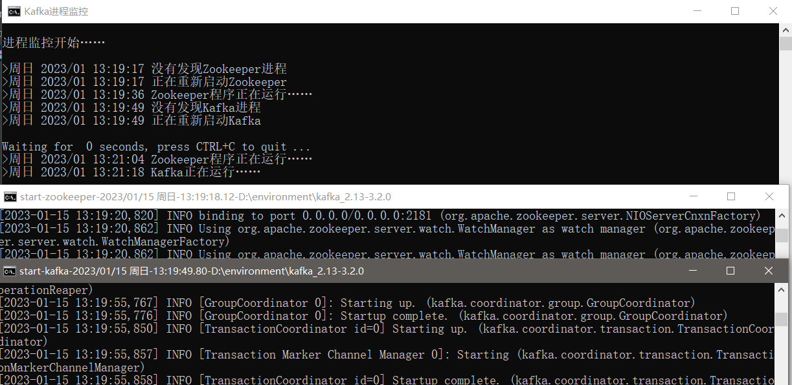

# kafka-monitoring-restart-script

## Linux
创建linux定时任务监控kafka进程，进行重启

1. 运行shell脚本
2. 输入kafka所在目录 例如：/usr/local/kafka_01_10
3. 脚本会在kafka目录下创建一个名为`kafkaRestart.sh`的shell脚本，其作用是检测进程中有没有kafka进行，如果没有则重启
4. 在crontab文件中创建定时任务

## Windows
编辑bat文件修改配置
1. 将kafka和zookeeper启动脚本放到各自的安装目录下，修改脚本内的启动命令
2. 修改监控脚本
   - KafkaPath： kafka目录
   - ZookeeperPath ： zookeeper目录

监控脚本调用的是kafka和zookeeper各自的启动脚本来启动，共启动3个终端窗口

